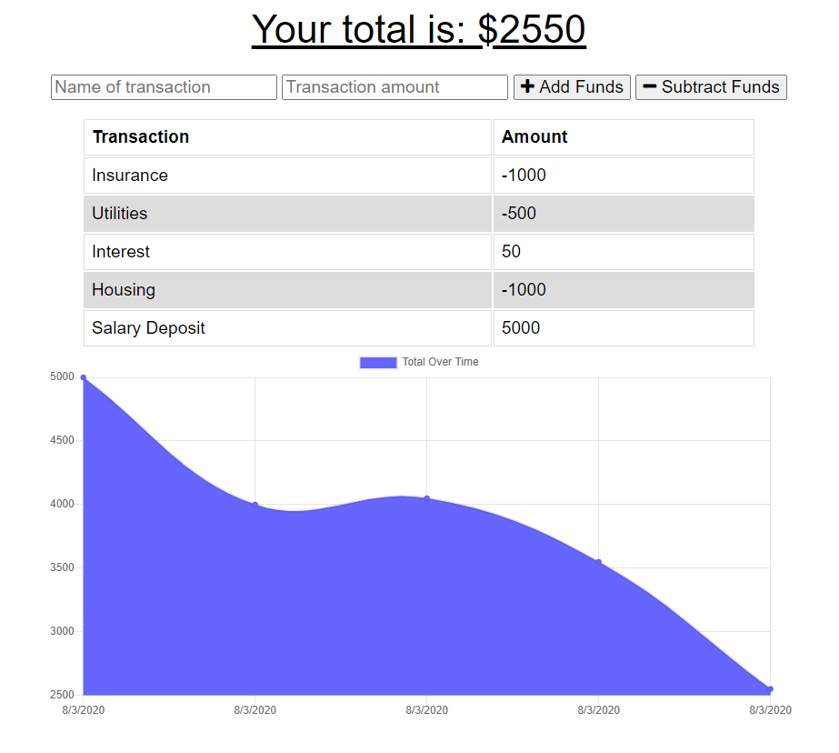

# Budget Tracker


Node-Express-Mongoose app using IndexedDB and PWA for tracking budgets online and offline.

## Table of Contents
- [Budget Tracker](#budget-tracker)
  - [Table of Contents](#table-of-contents)
  - [Installation](#installation)
    - [Front End](#front-end)
    - [Back End](#back-end)
  - [Launch](#launch)
  - [Usage](#usage)
- [Tests](#tests)
  - [Author](#author)

## Installation

### Front End
After cloning the repository, type:
```
npm install
```
to install all dependencies

### Back End
Make sure Mongo is running.

## Launch

To start the express server, type:
```
npm start
```
or
```
node ./server.js
```

## Usage

The dashboard displays a chart of existing transactions and some inputs for adding deposits and withdrawals. 

# Tests

First, add a few transactions to start and watch the chart update.

Second, open Developer Tools (F12) and switch to the Application Tab. Select Service Workers and check the box for Offline. You should see a warning icon immediately show up on the Network Tab.

Next, try adding a few transactions now. The app will appear to continue functioning as normal, but click IndexedDB and drill down to Budget-> Pending. You should see the offline transactions show up here. 

Flip the switch to get the app back online. Refresh the IndexedDB section and verify that the offline transactions have been flushed.

## Author

* **Johnny Li** - *Initial work* - [reptile18](https://github.com/reptile18)
